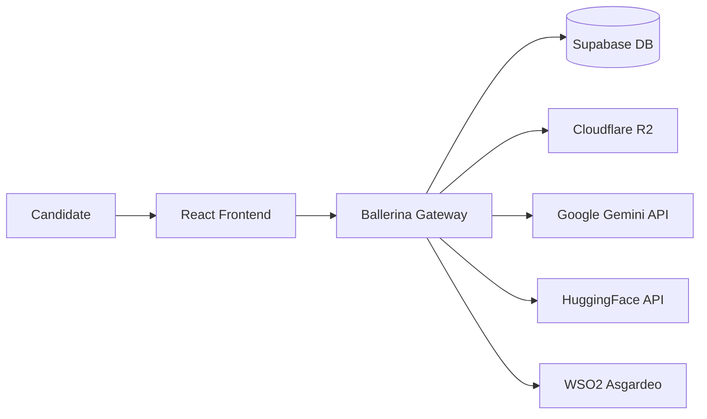

# 🛡️ EquiHire-Core: The Agentic Bias Firewall

<div align="center">
  
  <br />
  <strong>"Evaluating Code, Not Context."</strong>
  <br />
  <p>An AI-Native Blind Assessment Platform designed to act as an objective "Bias Firewall" for technical recruitment.</p>
</div>

---

## 🚀 Overview

EquiHire is built to bridge the gap in technical recruitment where subconscious biases often outweigh technical merit. In many regions, the **"Pedigree Effect"** prevents highly qualified candidates from non-prestigious backgrounds from even reaching the interview stage. 

EquiHire acts as a secure, AI-orchestrated gatekeeper that:
1.  **Sanitizes** candidate identity (redacting PII).
2.  **Evaluates** technical logic semantically.
3.  **Provides** transparent, constructive feedback for growth.

---

## ✨ Key Features

- **🔍 Context-Aware Extraction:** Automatically determines experience levels (Junior/Senior) and maps PII schemas using **Google Gemini Flash**.
- **🛡️ Zero-Shot Relevance Gate:** Filters out irrelevant or non-technical answers through a **HuggingFace** logic gate (`bart-large-mnli`), optimizing compute costs.
- **📊 Adaptive Scoring Engine:** Uses semantic analysis to grade answers against experience-specific rubrics rather than basic keyword matching.
- **📈 Personalized Growth Reports:** Generates detailed feedback for candidates, turning every rejection into a learning opportunity.
- **🔒 Lockdown Assessment:** A secure, high-integrity environment for high-stakes technical testing.

---

## 🛠️ Tech Stack

### Backend & AI Orchestration
- **Runtime:**  (Native JSON handling & Service Orchestration)
- **AI Models:** 
  - **Google Gemini API** (CV Parsing, Grading & Feedback)
  - **HuggingFace** (Relevance Gate)
- **PDF Extraction:** Apache PDFBox (Java Interop)

### Frontend
- **Framework:**  + TypeScript
- **Styling:** Tailwind CSS

### Infrastructure & Services
- **Auth:** WSO2 Asgardeo (Identity & Access Mgmt)
- **Database:** 
- **Storage:** Cloudflare R2 (Secure Object Storage)
- **Deployment:** WSO2 Choreo (Hybrid Cloud)

---

## 🏗️ System Architecture

EquiHire follows a **Hybrid Cloud architecture** deployed on WSO2 Choreo, ensuring core logic is isolated from heavy-duty AI processing.



*For more details, see the [Full Architecture Documentation](doc/introduction.md#system-architecture).*

---

## 🚦 Quick Start

### Prerequisites
- [Ballerina Swan Lake](https://ballerina.io/downloads/)
- [Node.js & npm](https://nodejs.org/)
- [Docker](https://www.docker.com/) (Optional, for local DB)

### Setup & Installation

1.  **Clone the Repository**
    ```bash
    git clone https://github.com/YourUsername/EquiHire-Core.git
    cd EquiHire-Core
    ```

2.  **Environment Configuration**
    - Configure `.env` in `react-frontend/` (refer to `.env.example`).
    - Configure `Config.toml` in `ballerina-gateway/` (refer to `Config.toml.example`).

3.  **Run the Backend**
    ```bash
    cd ballerina-gateway
    bal run
    ```

4.  **Run the Frontend**
    ```bash
    cd react-frontend
    npm install
    npm run dev
    ```

---

## 📂 Documentation

- 📄 **[Introduction](doc/introduction.md)**: Problem statement & architecture.
- ⚙️ **[Getting Started](doc/getting-started.md)**: Detailed configuration guide.
- 📡 **[API Reference](doc/api-endpoints.md)**: Integration details.
- 🔑 **[Identity Lifecycle](doc/identity-lifecycle.md)**: Authentication flows.

---

## 📄 License

This project is licensed under the **MIT License**. See the [LICENSE](LICENSE) file for details.

