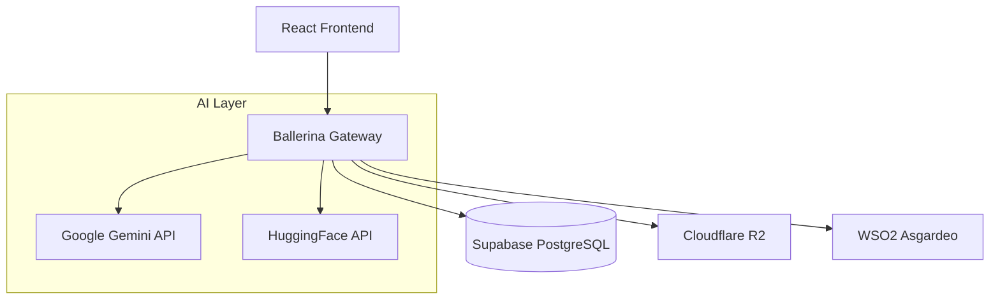

# EquiHire-Core: AI-Native Blind Assessment Platform

## The Agentic Bias Firewall for Technical Recruitment

EquiHire is an AI-Native Blind Assessment Platform engineered to eliminate subconscious bias in technical hiring. By acting as an objective "Bias Firewall," the platform ensures that recruitment decisions are based strictly on technical merit and logic rather than a candidate's background or pedigree.

---

## Project Overview

In many regions, technical recruitment is hindered by the "Pedigree Effect," where candidates from prestigious institutions are favored over high-potential talent from diverse backgrounds. EquiHire addresses this by:

1.  **Identity Sanitization:** Automatically redacting Personally Identifiable Information (PII) from candidate submissions.
2.  **Semantic Evaluation:** Assessing technical solutions based on logic and problem-solving quality rather than simple keyword matching.
3.  **Actionable Feedback:** Providing candidates with detailed "Growth Reports" to facilitate professional development.

---

## Core Features

### Context-Aware Extraction
The system utilizes Google Gemini Flash to parse CVs and extract relevant context, such as experience level and technical stack, while maintaining candidate anonymity through structured data mapping.

### Zero-Shot Relevance Gate
To optimize computational resources, candidate responses pass through a HuggingFace logic gate (specifically the `bart-large-mnli` model). This high-speed gate filters out irrelevant or non-technical content before it reaches more intensive grading models.

### Adaptive Scoring Engine
Technical assessments are graded semantically against pre-defined rubrics. The engine adapts its scoring criteria based on the candidate's inferred experience level, ensuring a fair and nuanced evaluation.

### High-Integrity Assessment Environment
EquiHire provides a secure environment designed to prevent unauthorized assistance during technical exams, preserving the integrity of the assessment data.

---

## Technical Stack

### Runtime and Orchestration
*   **Backend:** Ballerina Swan Lake (utilized for its native support for network-aware services and robust JSON data-binding).
*   **AI Integration:** 
    *   Google Gemini API (Structural parsing, semantic grading, and feedback generation).
    *   HuggingFace (Execution of the Zero-Shot Relevance Gate).
*   **Data Processing:** Apache PDFBox for high-fidelity text extraction from candidate documents.

### Frontend
*   **Framework:** React + TypeScript (Vite).
*   **Styling:** Vanilla CSS / Tailwind CSS for responsive and modern UI components.

### Infrastructure
*   **Identity Management:** WSO2 Asgardeo.
*   **Persistence:** Supabase (PostgreSQL).
*   **Object Storage:** Cloudflare R2 for secure, isolated storage of candidate documents and assessment data.

---

## System Architecture

EquiHire utilizes a Hybrid Cloud architecture to separate mission-critical logic from external AI services, ensuring high availability and security.



---

## Installation and Setup

### Prerequisites
*   Ballerina Swan Lake (Update 8 or higher)
*   Node.js (LTS version)
*   Supabase Account
*   Google Gemini API Access

### Backend Configuration
1.  Navigate to the `ballerina-gateway` directory.
2.  Copy `Config.toml.example` to `Config.toml`.
3.  Populate `Config.toml` with the necessary API keys and database credentials.
4.  Execute the service:
    ```bash
    bal run
    ```

### Frontend Configuration
1.  Navigate to the `react-frontend` directory.
2.  Install dependencies:
    ```bash
    npm install
    ```
3.  Configure environment variables in `.env` (refer to `.env.example`).
4.  Start the development server:
    ```bash
    npm run dev
    ```

---

## Documentation

For more detailed information, please refer to the following documents in the `doc/` directory:

*   [Introduction and Problem Statement](doc/introduction.md)
*   [Getting Started and Configuration](doc/getting-started.md)
*   [API Endpoint Reference](doc/api-endpoints.md)
*   [Identity and Authentication Lifecycle](doc/identity-lifecycle.md)

---

## License

This project is licensed under the MIT License.


