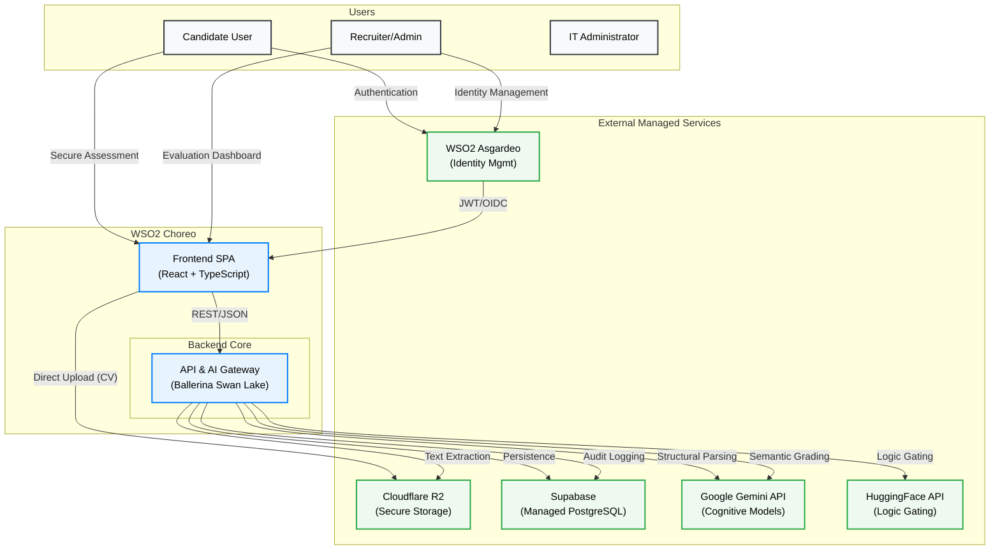

# EquiHire: The Agentic Bias Firewall

## Executive Summary

EquiHire is an AI-native recruitment platform engineered to eliminate subconscious bias in technical hiring. By implementing an automated "Bias Firewall," the platform shifts the recruitment focus from a candidate's pedigree and background to their objective technical merit and problem-solving capabilities.

---

## Strategic Objectives

The platform addresses critical inefficiencies and systemic biases in the modern technical recruitment landscape:

1.  **Neutralizing Institutional Bias:** Mitigating the "Pedigree Effect" where candidates from prestigious institutions are disproportionately favored over qualified talent from diverse backgrounds.
2.  **Scalable Semantic Screening:** Replacing manual, keyword-based screening with high-fidelity semantic evaluation capable of assessing technical logic at scale.
3.  **Transparent Candidate Growth:** Providing rejected candidates with actionable, AI-driven "Growth Reports" to facilitate professional development and closure.

---

## Core Innovation: The Context-Aware Assessment Engine

At the heart of EquiHire is a sophisticated integration hub that orchestrates multiple AI models to ensure fairness and accuracy.

### Technical Foundation
- **Orchestration:** Ballerina Swan Lake
- **Cognitive Layer:** Google Gemini 1.5 Flash
- **Logic Validation:** HuggingFace Zero-Shot Classification (`bart-large-mnli`)

### Functional Pipeline

**1. Semantic CV Sanitization**
The system extracts raw data from candidate documents using Apache PDFBox. Google Gemini then structuralizes this data, mapping Personally Identifiable Information (PII) to an isolated identity vault while determining experience levels and technical stacks.

**2. Zero-Shot Relevance Gating**
To ensure computational efficiency and prevent response tampering, candidate submissions pass through a high-speed logic gate. Responses with low technical relevance (confidence < 0.45) are automatically filtered out before reaching more resource-intensive grading layers.

**3. Adaptive Evaluation & Feedback**
Relevant responses are semantically graded against curated rubrics. The scoring engine adapts its criteria based on the candidate's inferred experience level, producing a final evaluation and a redacted "Growth Report" for the candidate.

---

## System Architecture

EquiHire utilizes a Hybrid Cloud architecture (deployed on WSO2 Choreo) to separate mission-critical logic from managed AI services, ensuring high availability and robust security.

### High-Level Orchestration (C4 Container Model)

---

## Architectural Principles

1.  **Hybrid Cloud Integration:** Strategic separation of core business logic from SaaS providers to maintain flexibility and security.
2.  **Unified Integration Hub:** Leveraging **Ballerina** for high-concurrency orchestration, native JSON data-binding, and robust error handling across LLM boundaries.
3.  **Composite AI Pipeline:** Utilizing task-specific models (Fast logic gating vs. Deep semantic grading) to optimize for both latency and accuracy.
4.  **Zero-Trust Identity Vault:** Ensuring candidate PII is never exposed to external AI services during the evaluation phase, maintaining a strictly "Blind" assessment environment.
